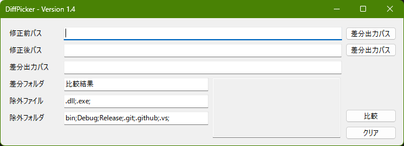

# DiffPicker

## プロジェクト概要
**DiffPicker** は2つのフォルダから差分のあるファイルを探索し、別フォルダに複製するアプリケーションです。

ファイルが膨大にある場合に予め差分のあるファイルだけにすることが目的で、その後はWinMergeを用いて実際の差異を確認します。

## 主な機能
- 2つのフォルダから差分のあるファイルを別フォルダに複製。片方にしかないファイルも差分とする。
- WinMergeで比較しやすいようWinMergeのプロジェクトファイルを作成
- 個人・商用問わず利用可能

## 使い方

- 修正前パス、修正後パスに比較したいフォルダパスを指定
- あとは良い感じに設定
- 比較ボタン押下で差分フォルダを作成し、差分ファイルを複製します
  - 差分フォルダが既に存在する場合はエラー

## インストール
1. releasesから最新のzipをダウンロードし、任意のフォルダに解凍します。インストーラーはないため解凍するだけです。
2. DiffPicker.exeを起動し、いい感じに使います。
3. 以上

## アンインストール
1. インストールした際の任意のフォルダを削除します。
2. 以上

## その他
- 修正前パス、修正後パス
  - 指定するのはフォルダではなくzipでも可能。githubでソースをダウンロードすることを想定。
  - テキストボックスにエクスプローラからドロップすることが可能
  - アプリケーション本体にドロップすると空いてるテキストボックスへ配置
  - どちらのテキストボックスも空の場合、アプリケーション本体に2つのパスをまとめてドロップすることで両方に配置
- xlsxの差分比較がたぶん可能（xlsxはファイル内に更新日付を持っているため更新日付が異なるだけで差分ありと判定される。そうならないよう工夫したつもり）

## License
This project is licensed under the MIT License. See the LICENSE file for details.
